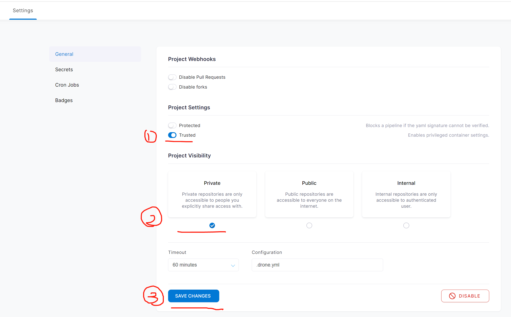
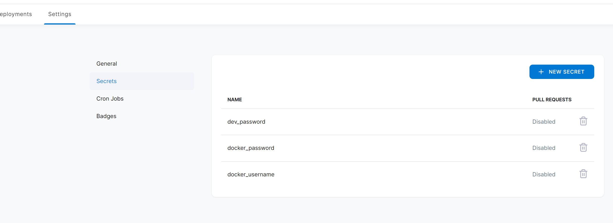

## 目标


## 使用步骤：
### 环境
- docker:20 + docker-compose:1.29
- [nexus](https://www.sonatype.com/products/repository-oss):3.x
- gitlab:11.1.x
- [harbor](https://goharbor.io/):2.2.x
- [drone](https://www.drone.io/):2.x + drone-runner-docker:1.x

#### 配置maven镜像

settings.xml 配置nexus

```xml
<?xml version="1.0" encoding="UTF-8"?>
<settings xmlns="http://maven.apache.org/SETTINGS/1.0.0"
xmlns:xsi="http://www.w3.org/2001/XMLSchema-instance"
xsi:schemaLocation="http://maven.apache.org/SETTINGS/1.0.0 http://maven.apache.org/xsd/settings-1.0.0.xsd">
<servers>
<server>
<id>nexus-public</id>
<username>repouser</username>
<password>repopwd</password>
</server>
<server>
<id>nexus-snapshots</id>
<username>repouser</username>
<password>repopwd</password>
</server>
        <server>
            <id>nexus-releases</id>
            <username>repouser</username>
            <password>repopwd</password>
        </server>
    </servers>
    <mirrors>
        <mirror>
            <id>nexus-public</id>
            <mirrorOf>*</mirrorOf>
            <name>Nexus Public</name>
            <url>http://nexus.domain.com/repository/maven-public/</url>
        </mirror>
    </mirrors>
    <profiles>
        <profile>
            <id>nexus-public</id>
            <repositories>
                <repository>
                    <id>nexus-public</id>
                    <url>http://nexus.domain.com/repository/maven-public/</url>
                    <releases>
                        <enabled>true</enabled>
                    </releases>
                    <snapshots>
                        <enabled>true</enabled>
                    </snapshots>
                </repository>
            </repositories>
        </profile>
    </profiles>
    <activeProfiles>
        <activeProfile>nexus-public</activeProfile>
    </activeProfiles>
</settings>
```

Dockerfile

```dockerfile
FROM maven:3-openjdk-8

COPY ./settings.xml /usr/share/maven/ref/
```

构建

```shell
docker build -t customize/maven .

docker tag customize/maven:latest harbor.domain.com/customize/maven:latest

docker push harbor.domain.com/customize/maven:latest
```


#### 配置drone 
#### 配置需要的 secrets 
#### 提交代码校验...

### 碰到的问题

1. 配置drone时, gitlab的webhooks始终没有<br>
   原因: 检查drone运行时配置的gitlab是否有问题, 配置了gitlab域名 但在drone中解析不了<br>
   解决: 直接该成ip解决
2. gitlab有webhooks, 但提交不触发. 在gitlab上webhooks点test则可以触发 <br>
   原因: 不明... <br> 
   解决: 删除仓库,重新配置 (做好备份!!) <br>

